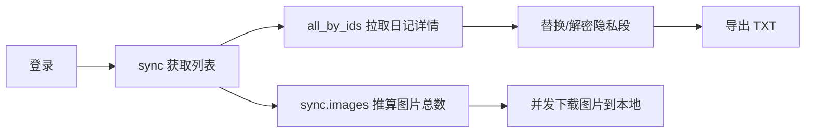

# 你记日记导出（nijiexportflutter）

面向「你记日记」的**第三方导出工具**（Flutter 多平台）。目前项目已达到**基本完工可用**：登录后可同步列表，导出日记 TXT / 批量导出图片，并支持对正文内的“隐私段”进行解密替换。

> **下载本项目 release（以及其它工具）：https://nijiweb.cn/pc**
>
> **网页版日记编辑：https://nijiweb.cn**

---

## 功能一览（以当前源码为准）

- 登录：LoginScreen
- 同步：ApiService.sync
- 导出日记 TXT：ExportService.exportAllDiariesToTxt
  - 日期范围（包含起止日）
  - 排序：自旧至新
  - 并发拉取详情、保持最终输出顺序
  - update_read_mark 调用失败不影响导出
- 导出图片：ExportService.exportAllImages
  - 跳过已存在文件
  - 并发下载
- 隐私段解密：CryptoService.decryptPrivacyCiphertext
  - AES-128-CBC + PKCS7
  - iv = key
  - hex/base64 兼容
  - replacePrivacyBlocks：解密失败回退保留原密文块



---

## 平台支持

本工程为标准 Flutter 多平台工程。

- 已验证可用：Windows / Android
- 其他平台：理论可构建，但未做完整验证（macOS / Linux / iOS / Web 等）

---

## 快速开始（源码自建）

### 1) 安装依赖

```bash
flutter pub get
```

### 2) 运行

Windows：

```bash
flutter run -d windows
```

Android：

```bash
flutter run -d <device>
```

### 3) 构建

Windows：

```bash
flutter build windows
```

Android APK：

```bash
flutter build apk
```

---

## 使用说明

### 1) 登录

打开应用进入登录页，输入账号/密码。

- 记住密码：会在本地保存账号与密码，用于下次自动填充
- 自动登录：下次启动将自动尝试登录（开启此项会自动勾选“记住密码”）

### 2) 导出日记 TXT

主界面点击「导出日记」。

高级选项（主界面右上「高级选项」）：

- 日期范围：不选则默认导出全部；选择后按范围过滤（包含起止日）
- 排序：勾选“日记自旧至新”则按旧 → 新输出

导出过程中会显示进度（已处理/总数）。导出完成后弹窗会给出文件路径。

### 3) 导出图片

主界面点击「导出图片」。

- 会先从 sync 结果推算图片总数
- 本地已存在则跳过
- 图片不存在/被删除则跳过

---

## 导出位置

导出目录策略（以当前实现为准）：

- **Android**：写入 `/storage/emulated/0/你的日记/`
  - 日记文件：`/storage/emulated/0/你的日记/<用户名>的日记.txt`
  - 图片目录：`/storage/emulated/0/你的日记/图片/`
- **非 Android**：写入应用 Documents 下的 `你记导出/`
  - 日记文件：`Documents/你记导出/<用户名>的日记.txt`
  - 图片目录：`Documents/你记导出/图片/`

---

## 常见问题（FAQ）

### 1) Android 导出失败：提示需要存储权限

Android 11+ 写入 `/storage/emulated/0/你的日记/` 通常需要“所有文件访问权限”（MANAGE_EXTERNAL_STORAGE）。

处理方式：

1. 在系统设置中为本应用开启存储相关权限
2. 返回应用重新点击导出

### 2) 隐私段解密失败怎么办？

可能原因包括：密文本身损坏、账号对应 userId 不一致、密文编码异常等。

回退策略：

- 工具会**保留原始密文块**（replacePrivacyBlocks 回退），不会用“解密失败”的占位文本覆盖你的原内容。

---

## 免责声明

- 本项目为**第三方工具**，与「你记日记」官方无任何隶属/合作关系。
- 使用本工具导出、解密、保存数据存在一定风险（账号安全、数据完整性、设备权限等），请自行评估并承担后果。

---

## 许可证

本项目以 **MIT License** 方式开源。

> 若仓库未附带独立的 LICENSE 文件，则以本 README 的声明为准。

---

## 历史 / 迁移说明（可折叠）

<details>
<summary>展开查看：早期施工日志 / 计划 / 迁移备忘录（已归档，可能过时）</summary>

> 注：以下内容为项目早期的施工记录/迁移参考；当前能力请以上方“功能一览”与源码实现为准。

### 当前项目进度（以代码为准）

### ✅ 已完成

1. **基础工程与依赖**：已接入 `dio`、`shared_preferences`、`encrypt`、`path_provider`、`intl`、`window_manager` 等（见 `pubspec.yaml`）。
2. **窗口与路由骨架**：Windows 窄窗口尺寸、路由 `/` → 登录、`/main` → 主界面（见 `lib/main.dart`）。
3. **登录页（可用）**：账号/密码输入、记住密码、自动登录、注册弹窗（见 `lib/screens/login_screen.dart`）。
4. **主界面（可用）**：读取并展示用户名/格言/头像；退出登录（见 `lib/screens/main_screen.dart`）。
5. **API 基础调用（已打通登录）**：`/api/login/` 登录并保存 token + userid；提供 `sync` 的占位拉取（见 `lib/services/api_service.dart`）。
6. **常量与主题**：API 地址、隐私标签正则、主题色与输入框/按钮风格（见 `lib/core/constants.dart`、`lib/core/theme.dart`）。


## 开发与运行

1. 安装依赖：`flutter pub get`
2. Windows 运行：`flutter run -d windows`
3. Android 运行：`flutter run -d <device>`

---

## 目录结构（规划 vs 现状）

> 注：下述为规划结构；目前代码已落地的文件以「当前项目进度」章节列出的为准。

```text
lib/
├── core/
│   ├── constants.dart      # 存储 API 地址、正则表达式等
│   └── theme.dart          # 界面颜色配置（复现 aardio 的 14657884 背景色）
├── models/
│   ├── user_config.dart    # 用户信息模型
│   └── diary_entry.dart    # 单篇日记模型
├── services/
│   ├── auth_service.dart   # 登录逻辑：Token 获取与刷新
│   ├── diary_service.dart  # 数据逻辑：日记同步、Unicode 清洗
│   ├── crypto_service.dart # 安全逻辑：AES 解密函数
│   └── file_service.dart   # IO 逻辑：TXT 拼接、图片下载、权限申请
├── screens/
│   ├── login_screen.dart   # 登录界面（含自动登录逻辑）
│   └── home_screen.dart    # 主操作界面（进度条、导出按钮、格言显示）
└── widgets/
    └── custom_button.dart  # 封装复用 aardio 风格的按钮

```

---

## 二、 施工步骤规划 (Roadmap)

### 第一阶段：基础设施 (Setup)

1. **环境初始化**：创建项目，配置 `pubspec.yaml` 依赖。
2. **常量定义**：在 `constants.dart` 中存入 `nideriji.cn` 的各 API 路径。
3. **UI 预研**：实现登录界面的布局，确保在 Windows 窄窗口和手机全屏下都能正常显示。

### 第二阶段：认证模块 (Auth)

1. **登录对接**：使用 `Dio` 发送 POST 请求，处理返回的 JSON。
2. **配置持久化**：复现 aardio 中的“记住密码”和“自动登录”，在 `main.dart` 启动时检查保存的状态。
3. **拦截器配置**：将 Token 自动注入后续所有请求的 Header。

### 第三阶段：核心解密逻辑 (The "Hard" Part)

1. **Unicode 清洗**：编写 Dart 函数处理那些导致解析失败的特殊 Unicode 代理对。
2. **AES 翻译**：根据 Aardio 代码（`aes.setPassword(userID)`），在 Dart 中利用 `encrypt` 包实现对应的解密函数。
* *难点对齐：Aardio 的默认 AES 设置可能需要通过实验确认是 PKCS7 还是其他填充方式。*


### 第四阶段：同步与导出 (Sync & Export)

1. **列表同步**：获取日记 ID 列表（`sync` 接口）。
2. **逐条获取与解密**：实现 Aardio 里的 `while` 循环，带进度回显。
3. **文件 IO**：
* **Windows**：直接写入本地文件流。
* **Android**：先存入缓存，再触发系统分享或申请 `MANAGE_EXTERNAL_STORAGE` 权限。


### 第五阶段：优化与打包 (Polish & Build)

1. **错误处理**：加入异常捕获（如网络超时、密码错误弹窗）。
2. **图片批量下载**：实现图片的异步并行下载。
3. **构建发行版**：`flutter build windows` 和 `flutter build apk`。

---

## 三、 关键逻辑备忘录 (Migration Notes)

* **UI 颜色转换**：Aardio 的十进制颜色 `14657884` 转换为 Flutter 十六进制（需加透明度 `0xFF`）。
* **多线程处理**：Aardio 使用 `thread.invoke`，Flutter 使用 `compute` 或简单的 `async/await`（因为 Dart 是单线程事件循环机制，耗时计算需注意不阻塞 UI）。
* **正则匹配**：Aardio 使用 `preg`，Flutter 使用 `RegExp` 类，语法略有差异。

---

（历史蓝图保留）

**另，后续的构建中，可以参考以下aardio原始代码（主要是给ai看的）**

```aardio

import win.ui;
import inet.http;
import crypt.bin;
import crypt.aes;
import preg;
/*DSG{{*/
mainForm = win.form(text="你的日记导出";right=399;bottom=623;bgcolor=14657884;border="dialog frame";max=false)
mainForm.add(
avatarPic={cls="picturebox";left=32;top=48;right=128;bottom=144;image=$"\res\logo.bmp";notify=1;z=1};
checkbox={cls="checkbox";text="日记自旧至新";left=216;top=592;right=320;bottom=624;bgcolor=14657884;color=15793151;z=6};
datetimepick={cls="datetimepick";left=73;top=432;right=157;bottom=452;edge=1;z=7};
datetimepick2={cls="datetimepick";left=245;top=431;right=328;bottom=451;edge=1;z=8};
geyanEdit={cls="edit";text="格言字数多一点才好测试自动换行";left=160;top=88;right=368;bottom=144;autohscroll=false;bgcolor=14657884;color=15793151;font=LOGFONT(h=-16;name='微软雅黑');multiline=1;readonly=1;z=4};
nameLabel={cls="static";text="用户名";left=160;top=40;right=368;bottom=80;color=15793151;font=LOGFONT(h=-26;name='微软雅黑');transparent=1;z=3};
picPlus={cls="plus";text="保存图片";left=72;top=528;right=328;bottom=568;background="\res\regButton.png";color=11897941;font=LOGFONT(h=-22;name='微软雅黑');notify=1;z=2};
static={cls="static";text="~";left=181;top=398;right=221;bottom=468;font=LOGFONT(h=-56);transparent=1;z=9};
txtPlus={cls="plus";text="保存为txt";left=72;top=472;right=328;bottom=512;background="\res\regButton.png";color=11897941;font=LOGFONT(h=-22;name='微软雅黑');notify=1;z=5}
)
/*}}*/

mainForm.avatarPic.image = "http://f.nideriji.cn" ++ userConfig.avatar;
mainForm.nameLabel.text = userConfig.name;
mainForm.geyanEdit.text = userConfig.description;


mainForm.txtPlus.skin(
	background = { 
		hover = "/res/images/btn-hover.png";
		focus = "/res/images/btn-focus.jpg";
		active = "/res/images/btn-active.png";
		disabled = "/res/images/btn-disabled.png"; 
	}
	
)
mainForm.txtPlus.oncommand = function(id,event){
		mainForm.txtPlus.text = "正在保存";
		mainForm.txtPlus.disabled = true;
		thread.invoke( 
			function(diaryResult,loginResult,mainForm){
				
				import web.rest.client;
				import web.json;
				import string.chineseNumber;
				import crypt.bin;
				import crypt.aes;
				import preg;
								
				secureJson = function(str) {
					/*	
						这是一种极其逆天的解决方法。因为开发者的愚蠢，没有找到正确方法进行正则匹配非法unicode代理对
						所以我选择把临近diary略缩右引号emoji常用的高代理对都用写死的方法删掉了。这个对照列表可能不全
						需要之后添加其他高代理对，或者找到更好的解决方案。无所谓了！反正迟早要迁移走放弃aar项目。
					*/
					i = /*\\ud83c\"*/
					j = /*\\ud83d\"*/
					k = /*\\ud83e\"*/
					l = /*\"*/
					str = string.replace(str,i,l);
					str = string.replace(str,j,l);
					str = string.replace(str,k,l);
    				str = web.json.parse(str);
    				return str;
				}

				function decryptDiary2AES(cryptContent){
    				// 精确匹配完整标签（包含标点）
    				var regex = preg(
        				"\[以下是隐私区域密文，请不要做任何编辑，否则可能导致解密失败\]([\s\S]+?)\s*\[以上是隐私日记，请不要编辑密文\]",
        				"g"
    				);
					
    				return regex.replace(cryptContent, function(match, ciphertext){
				
						aes.setPassword(tostring(userID))
						var unb64 = crypt.bin.decodeBase64(match);
						var unhex = string.unhex(match,"");
						var plaintext = aes.decrypt(unhex);
						if(plaintext){
							return "[隐私区域开始]" + plaintext + "[隐私区域结束]";
						}
						else {
							//处理解密失败、密文被破坏的情况。
							var plaintext = aes.decrypt(unb64);
							if(plaintext){
								return "[隐私区域开始]" + plaintext + "[隐私区域结束]";
							}
							else {
								return "[以下是隐私区域密文，请不要做任何编辑，否则可能导致解密失败]" + match + "[以上是隐私日记，请不要编辑密文]"; 
							}
						}
						
    				});
				}

				http = web.rest.client();
				http.addHeaders = {						//正式登陆
					["auth"] = "token " ++ loginResult.token;
    				["user-agent"] = "OhApp/3.6.12 Platform/Android";
    			}
				diaries = {};
    			diaries = diaryResult[["diaries"]];
    			userConfig = diaryResult[["user_config"]];
    			diaryFileName = userConfig[["name"]] + "的日记.txt";
    			
				saveDiary = function(){
					
					zh = string.chineseNumber();//数字转汉字转换器，获取星期需用。
					if(io.exist(diaryFileName)){
						io.remove(diaryFileName)	
					}
					file = io.open(diaryFileName,"w+");
					totalStr = "";	//所有日记
					singleStr = "";	//单篇日记
    				userID = diaryResult["user_config"]["userid"];
    				aes = crypt.aes();
    				aes.setPassword( tostring(userID) ); // 128位密钥（16字符）
    				i = #diaryResult["diaries"];
    				j = 1;
					while(j <= i ){
						diaryID = diaryResult["diaries"][j]["id"]
						mainForm.txtPlus.text = "进度：" + j + "/" + i;
						getAllResponse = web.json.parse(http.api("https://nideriji.cn/api/diary/all_by_ids/" ++ userID ++ "/").post(
							diary_ids = diaryID;
						));
						if(getAllResponse["diaries"][1]){
							http.api("https://nideriji.cn/api/update_read_mark/" ++ diaryID ++ "/").get();
							returnJson = getAllResponse["diaries"][1];
							returnJson["content"] = decryptDiary2AES( returnJson["content"] );
							singleStr = tostring(time(returnJson.createddate,"%Y-%m-%d")) ++ " " ++
							string.replace("星期" ++ zh.number((time(returnJson.createddate,"%Y-%m-%d]").dayofweek)),"零","天") ++ '\n' ++
							returnJson.title ++ '\n' ++ string.replace(returnJson.content,'\r','') ++ '\n————————————————————\n';
									
							if(mainForm.checkbox.checked){
								totalStr = singleStr ++ totalStr;
							}
							else {
								totalStr = totalStr ++ singleStr;
							}
						}
						
						j++;
					
					}//大while括号
					file.write(totalStr);
					mainForm.msgbox("日记已保存在软件目录下「" + diaryFileName + "」");
					mainForm.msgbox("如果您使用电脑自带的记事本软件打开后显示乱码，只需要更换其他txt编辑器即可");
					mainForm.msgbox("感谢您的使用~");
					mainForm.txtPlus.text = "保存为txt";
					mainForm.txtPlus.disabled = false;
				}
				saveDiary();
			},diaryResult,loginResult,mainForm
		)
}

mainForm.onClose = function(hwnd,message,wParam,lParam){
    loginForm.close()
}

mainForm.picPlus.skin(
	background = { 
		hover = "/res/images/btn-hover.png";
		focus = "/res/images/btn-focus.jpg";
		active = "/res/images/btn-active.png";
		disabled = "/res/images/btn-disabled.png"; 
	}
)
mainForm.picPlus.oncommand = function(id,event){
	mainForm.picPlus.text = "正在获取图片总数";
	mainForm.picPlus.disabled = true;
	thread.invoke( 
		function(loginResult,mainForm){
			import web.rest.client;
			import web.json;
			secureJson = function(str) {
				/*	
					这是一种极其逆天的解决方法。因为开发者的愚蠢，没有找到正确方法进行正则匹配非法unicode代理对
					所以我选择把临近diary略缩右引号emoji常用的高代理对都用写死的方法删掉了。这个对照列表可能不全
					需要之后添加其他高代理对，或者找到更好的解决方案。无所谓了！反正迟早要迁移走放弃aar项目。
				*/
				i = /*\\ud83c\"*/
				j = /*\\ud83d\"*/
				k = /*\\ud83e\"*/
				l = /*\"*/
				str = string.replace(str,i,l);
				str = string.replace(str,j,l);
				str = string.replace(str,k,l);
    			str = web.json.parse(str);
    			return str;
			}
			
			http = web.rest.client();
			http.addHeaders = {						//登录
					["auth"] = "token " ++ loginResult.token;
    				["user-agent"] = "OhApp/3.6.12 Platform/Android";
    		}
    		diaryResult = secureJson(http.api("https://nideriji.cn/api/v2/sync/").post());
    		userConfig = diaryResult[["user_config"]];
    		picTable = diaryResult[["images"]];
    		picTotal = picTable[table.len(picTable)].image_id;
    		
    		http.addHeaders = {						//添加host登录
					["auth"] = "token " ++ loginResult.token;
    				["user-agent"] = "OhApp/3.6.12 Platform/Android";
    				["Host"] = "f.nideriji.cn";
    		}
    		
    		for(i=1;picTotal){
    		    mainForm.picPlus.text = "正在保存图" ++ i;
    		    if(!io.exist("/图片/图" ++ i ++ ".jpg")){
    				picApi = http.api("https://f.nideriji.cn/api/image/" ++ userConfig.userid ++ "/" ++ i ++ "/");
    				pic = picApi.get();
    				
    				if(pic){//防止该图被删
    			    	string.save("/图片/图" ++ i ++ ".jpg",pic )
    				}
    			}
    		}
    		mainForm.msgbox("图片已全部保存至“图片”文件夹！");
			mainForm.msgbox("感谢您的使用~");
    		mainForm.picPlus.text = "保存图片";
    		mainForm.picPlus.disabled = false;
			
		},loginResult,mainForm
	);
}

secureJson = function(str) {
	/*	
		这是一种极其逆天的解决方法。因为开发者的愚蠢，没有找到正确方法进行正则匹配非法unicode代理对
		所以我选择把临近diary略缩右引号emoji常用的高代理对都用写死的方法删掉了。这个对照列表可能不全
		需要之后添加其他高代理对，或者找到更好的解决方案。无所谓了！反正迟早要迁移走放弃aar项目。
	*/
	i = /*\\ud83c\"*/
	j = /*\\ud83d\"*/
	k = /*\\ud83e\"*/
	l = /*\"*/
	str = string.replace(str,i,l);
	str = string.replace(str,j,l);
	str = string.replace(str,k,l);
    str = web.json.parse(str);
    return str;
}


mainForm.datetimepick.setFormat("yyy-MM-dd");
mainForm.datetimepick2.setFormat("yyy-MM-dd")
mainForm.show();
win.loopMessage();
return mainForm;

```
